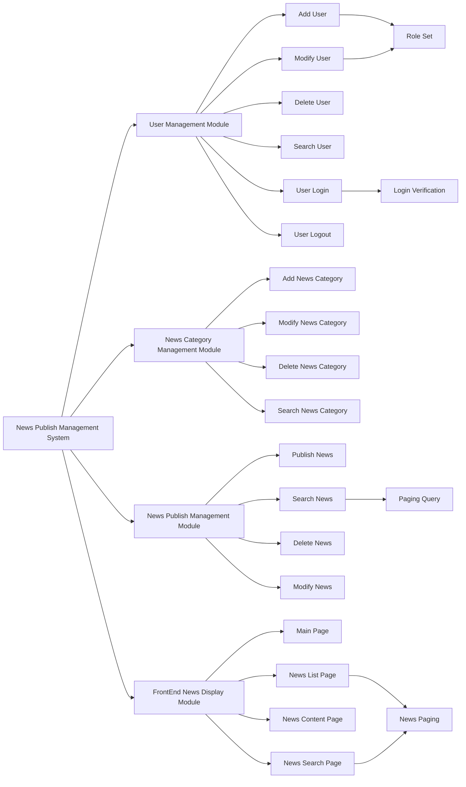

# News Publish Management System with SSM

## Environment Background

- Java JDK 1.8.0

  Download Link: https://www.oracle.com/hk/java/technologies/javase/javase8-archive-downloads.html

- Spring 4.3.6  

  Download Link: https://repo.spring.io/ui/native/libs-release-local/org/springframework/spring/4.3.6.RELEASE/

- MySQL 8.0.30

  Download Link: https://dev.mysql.com/downloads/windows/installer/8.0.html

- MyBatis 3.4.2

  Download Link: https://github.com/mybatis/mybatis-3/releases/tag/mybatis-3.4.2

- Eclipse JEE-2022-09 

  Download Link: https://www.eclipse.org/downloads/

- Project Type

  Dynamic Web Project, Version 3.0

## All JAR Package Dependencies (36)

| Spring Related JAR Packages           |
| ------------------------------------- |
| `aopalliance-1.0.jar`                 |
| `spring-aop-4.3.6.RELEASE.jar`        |
| `spring-aspects-4.3.6.RELEASE.jar`    |
| `aspectjweaver-1.8.10.jar`            |
| `spring-beans-4.3.6.RELEASE.jar`      |
| `spring-context-4.3.6.RELEASE.jar`    |
| `spring-core-4.3.6.RELEASE.jar`       |
| `spring-expression-4.3.6.RELEASE.jar` |
| `spring-jdbc-4.3.6.RELEASE.jar`       |
| `spring-tx-4.3.6.RELEASE.jar`         |
| `commons-logging-1.2.jar`             |

| SpringMVC Related JAR Packages    |
| --------------------------------- |
| `spring-web-4.3.6.RELEASE.jar`    |
| `spring-webmvc-4.3.6.RELEASE.jar` |
| `javax.servlet-api-4.0.1.jar`     |

| MySQL and Database Connection Pool Related JAR Packages |
| ------------------------------------------------------- |
| `mysql-connector-java-commercial-5.1.7-bin.jar`         |
| `commons-dbcp2-2.1.1.jar`                               |
| `commons-pool2-2.4.2.jar`                               |

| MyBatis Related JAR Packages |
| ---------------------------- |
| `ant-1.9.6.jar`              |
| `ant-launcher-1.9.6.jar`     |
| `asm-5.1.jar`                |
| `cglib-3.2.4.jar`            |
| `javassist-3.21.0-GA.jar`    |
| `log4j-1.2.17.jar`           |
| `log4j-api-2.3.jar`          |
| `log4j-core-2.3.jar`         |
| `mybatis-3.4.2.jar`          |
| `mybatis-spring-1.3.1.jar`   |
| `ognl-3.1.12.jar`            |
| `slf4j-api-1.7.22.jar`       |
| `slf4j-log4j12-1.7.22.jar`   |

| JSTL (JSP Standard Tag Library) Related JAR Packages |
| ---------------------------------------------------- |
| `taglibs-standard-spec-1.2.5.jar`                    |
| `taglibs-standard-impl-1.2.5.jar`                    |

| Jackson Related JAR Packages    |
| ------------------------------- |
| `jackson-annotation-2.13.4.jar` |
| `jackson-core-2.13.4.jar`       |
| `jackson-databind-2.13.4.2.jar` |

| Java Tool Related JAR Packages |
| ------------------------------ |
| `commons-lang3-3.4.jar`        |

## System Functional Structure

## System Architecture Design

- Persistent Object Layer

  Consists of multiple persistent classes

- Data Access Layer

  Consists of multiple DAO interfaces and their MyBatis mapping xml files

- Business Logic Layer

  Consists of multiple Service interfaces and their implementation classes

- Web Presentation Layer

  Consists of SpringMVC controller classes and JSP pages

## Database Analysis and Design

According to the requirements, there are **four** main entities: 

1) **role entity**
2) **user entity**
3) **(news) category entity **
4) **news entity**

Within them, their mapping relationships are:

- role - user: one to many
- category - news: one to many
- user - news: one to many

Foreign key connections:

- **roleId** in user table references to role table
- **categoryId** in news table references to category table
- **userId** in news table references to user table

### t_role table

| Field Name | Type      | Length | Description | Remark      |
| ---------- | --------- | ------ | ----------- | ----------- |
| `roleId`   | `Int`     | `32`   | Role ID     | Primary key |
| `roleName` | `VarChar` | `20`   | Role Name   |             |

### t_user table

| Field Name     | Type       | Length | Description         | Remark                                            |
| -------------- | ---------- | ------ | ------------------- | ------------------------------------------------- |
| `userId`       | `Int`      | `32`   | User ID             | Primary Key                                       |
| `userName`     | `VarChar`  | `20`   | User Name           |                                                   |
| `loginName`    | `VarChar`  | `20`   | Login Name          |                                                   |
| `password`     | `VarChar`  | `20`   | Login Password      |                                                   |
| `roleId`       | `Int`      | `32`   | Role ID             | Foreign Key                                       |
| `tel`          | `VarChar`  | `50`   | Phone Number        |                                                   |
| `registerTime` | `DataTime` |        | First Register Time |                                                   |
| `status`       | `Char`     | `1`    | Register Status     | '1': Not Activated; '2': Activated; '3': Disabled |

### t_category table

| Field Name     | Type      | Length | Description   | Remark      |
| -------------- | --------- | ------ | ------------- | ----------- |
| `categoryId`   | `Int`     | `32`   | Category ID   | Primary Key |
| `categoryName` | `VarChar` | `20`   | Category Name |             |

### t_news table

| Field Name        | Type       | Length | Description            | Remark                       |
| ----------------- | ---------- | ------ | ---------------------- | ---------------------------- |
| `newsId`          | `Int`      | `32`   | news ID                | Primary Key                  |
| `title`           | `VarChar`  | `60`   | News Title             |                              |
| `contentTitle`    | `VarChar`  | `120`  | News Content Title     |                              |
| `titlePicUrl`     | `VarChar`  | `120`  | Title Picture URL Path |                              |
| `content`         | `Text`     |        | News Content           |                              |
| `contentAbstract` | `VarChar`  | `300`  | News Summary           |                              |
| `keywords`        | `VarChar`  | `100`  | News keywords          |                              |
| `categoryId`      | `Int`      | `32`   | News category ID       | Foreign Key                  |
| `userId`          | `Int`      | `32`   | News publish user ID   | Foreign Key                  |
| `author`          | `VarChar`  | `30`   | News Author (Source)   |                              |
| `publishTime`     | `DataTime` | `120`  | News publish time      |                              |
| `clicks`          | `Int`      | `32`   | View times             |                              |
| `publishStatus`   | `Char`     | `1`    | News publish status    | '1':Release; '2': Retraction |